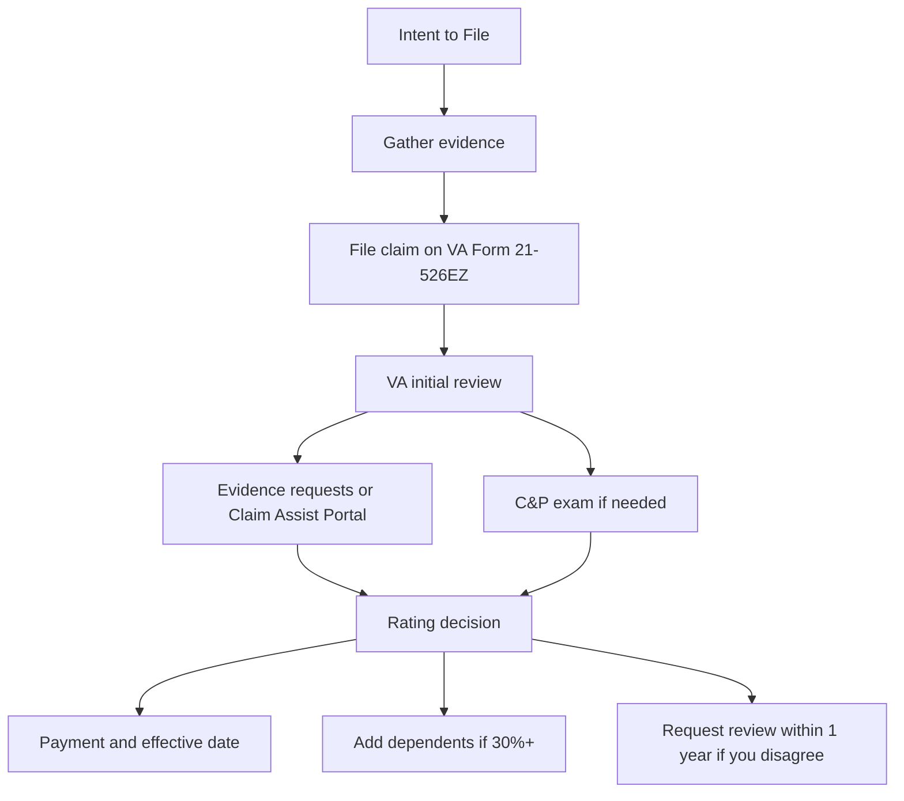
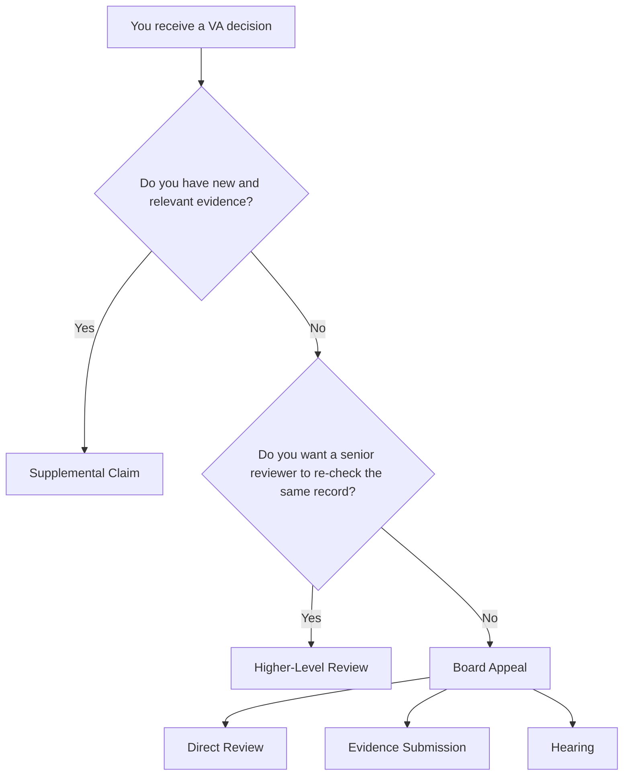

# U.S. Veteran Benefits Guide

## Executive summary

This README-style guide is an up-to-date, primary-source-first overview of major benefits available to U.S. military Veterans as of **June 28, 2026**. It focuses on two big buckets: **service-connected disability benefits** and **general Veteran benefits**. For disability, the most important thresholds are: **0%** establishes service connection but usually no monthly compensation; **10% to 20%** begins monthly compensation and generally places you in VA health care **Priority Group 3**; **30% to 40%** unlocks dependent pay and usually **Priority Group 2**; **50% and above** generally places you in **Priority Group 1** with the broadest no-copay health access; **60% or 70%/40%** may open the door to **TDIU** if service-connected conditions prevent substantially gainful employment; and **100%**, especially **100% permanent and total**, unlocks the largest set of derivative benefits for dependents, including **Chapter 35 DEA** and often **CHAMPVA**. VA’s current 2026 disability compensation rates are effective **December 1, 2025**. citeturn10view0turn27view0turn21search1turn37search0turn21search8

For general benefits, the core programs most Veterans should check are: **VA health care**, **disability compensation**, **Veterans Pension**, **GI Bill/education benefits**, **VA home loans**, **burial and memorial benefits**, and **employment assistance**. Some of the biggest recent changes are the ongoing implementation of the **PACT Act**, which expanded toxic-exposure-related care and compensation and accelerated health care access beginning **March 5, 2024**; implementation of the **Rudisill/Perkins** education decisions, which can allow some Veterans to receive up to **48 months** of education entitlement; new 2026-era claims tools such as the **Claim Assist Portal**; and a pending **August 1, 2026** cutoff for Chapter 35 secondary-school payments for programs starting on or after that date. citeturn12search0turn14search8turn14search4turn19search17turn37search6turn37search7

The fastest practical path to benefits is usually: **file an Intent to File**, submit a complete claim with strong evidence, attend your C&P exam, add dependents once you hit 30% or higher, enroll in VA health care even if you think you have “small” ratings, and use a **VA-accredited representative** rather than paying an unaccredited “claims consultant.” VA-accredited VSO representatives provide free help on claims, evidence gathering, and decision reviews. citeturn15search0turn15search8turn19search1turn19search5turn20search9

## Table of contents

- [Service-connected disability ratings](#service-connected-disability-ratings)
  - [How ratings work](#how-ratings-work)
  - [Base compensation table](#base-compensation-table)
  - [Benefits by rating tier](#benefits-by-rating-tier)
  - [Presumptive conditions cheat sheet](#presumptive-conditions-cheat-sheet)
- [Core veteran benefits](#core-veteran-benefits)
  - [VA health care](#va-health-care)
  - [Education and GI Bill](#education-and-gi-bill)
  - [VA home loan and housing grants](#va-home-loan-and-housing-grants)
  - [Pension](#pension)
  - [Burial and memorial benefits](#burial-and-memorial-benefits)
  - [Employment and federal hiring](#employment-and-federal-hiring)
  - [Social Security overlap](#social-security-overlap)
- [Applications, forms, evidence, and timing](#applications-forms-evidence-and-timing)
  - [Step-by-step disability claim playbook](#step-by-step-disability-claim-playbook)
  - [Main forms and what they do](#main-forms-and-what-they-do)
  - [Timelines and process flow](#timelines-and-process-flow)
- [Appeals, reviews, pitfalls, and cheat codes](#appeals-reviews-pitfalls-and-cheat-codes)
  - [Appeals lanes](#appeals-lanes)
  - [Common pitfalls](#common-pitfalls)
  - [Practical cheat codes](#practical-cheat-codes)
- [State, local, and nonprofit help](#state-local-and-nonprofit-help)
  - [What varies by state](#what-varies-by-state)
  - [Official state veterans affairs portals](#official-state-veterans-affairs-portals)
  - [Major nonprofit resources](#major-nonprofit-resources)
- [Recent changes, source verification, and resources](#recent-changes-source-verification-and-resources)
  - [Recent policy changes and effective dates](#recent-policy-changes-and-effective-dates)
  - [Verification of sources](#verification-of-sources)
  - [Prioritized resources and links](#prioritized-resources-and-links)
  - [Open questions and limitations](#open-questions-and-limitations)

## Service-connected disability ratings

### How ratings work

A VA disability rating is the percentage VA assigns to a service-connected condition based on severity. VA uses that rating to determine **monthly tax-free disability compensation** and eligibility for many other benefits. If you have more than one service-connected condition, VA uses the **“whole person”** method rather than simple addition, and the combined result is then rounded to the nearest 10%. Under 38 C.F.R. § 4.25, a person who is 60% disabled is treated as 40% efficient before the next rating is applied; this is why **60% + 40% does not equal 100%**, but instead combines to **76%**, which rounds to **80%**. A bilateral factor can also apply in some paired-extremity cases under 38 C.F.R. § 4.26. citeturn11search12turn31search1turn31search2turn31search14

A few examples make the math easier:

- **50% + 30%** → 50 leaves 50 efficiency; 30% of the remaining 50 is 15; total 65 → rounded to **70%**. citeturn31search2turn31search1
- **70% + 20% + 10%** → 70 leaves 30 efficiency; 20% of 30 is 6, so 76; 10% of remaining 24 is 2.4, so 78.4 → rounded to **80%**. citeturn31search2turn31search1
- **A 0% rating** still matters because it formally establishes service connection, which can support VA health access for the condition itself, future increases, secondary claims, and some derivative benefits. citeturn9view0turn26view0

### Base compensation table

The table below shows the **base monthly 2026 compensation rate for a Veteran alone, with no dependents**. For **30% and above**, dependent additions can increase the amount. VA’s current rate tables are effective **December 1, 2025**. citeturn10view0

| Combined rating | Monthly compensation for Veteran alone |
|---|---:|
| 0% | $0.00 |
| 10% | $180.42 |
| 20% | $356.66 |
| 30% | $552.47 |
| 40% | $795.84 |
| 50% | $1,132.90 |
| 60% | $1,435.02 |
| 70% | $1,808.45 |
| 80% | $2,102.15 |
| 90% | $2,362.30 |
| 100% | $3,938.58 |

**Important thresholds:** VA does **not** pay extra for dependents at **10% or 20%**. Extra dependent compensation starts at **30%**. At 30% and above, rates rise for spouses, children, dependent parents, and a spouse receiving Aid and Attendance. For example, the 2026 rate for a Veteran at **30% with a spouse and no children** is **$617.47**; at **70% with spouse, one child, and spouse Aid & Attendance**, the worked example on VA’s rate page totals **$2,367.45**. citeturn10view0

### Benefits by rating tier

The most practical way to think about ratings is not just the payment, but the **benefits unlocked at each threshold**.

| Rating tier | Core compensation effect | Health care access and cost-sharing | Major threshold benefits and notes |
|---|---|---|---|
| **0%** | Service connection established, but no monthly compensation | Noncompensable 0% Veterans may still receive care for their service-connected condition; exact enrollment/cost status depends on income and priority-group rules | Useful for future increases, secondary claims, and proving nexus. VA’s eligibility matrix notes possible no-cost care/prescriptions for service-connected disabilities if income limits are met, travel pay in some cases, and federal hiring preference issues. citeturn26view0turn9view0 |
| **10%–20%** | First monthly compensation starts at $180.42 and $356.66 | Usually Priority Group 3; Veterans with 10% or higher service-connected ratings generally do not pay outpatient or inpatient copays; non-service-connected prescriptions may still have copays below 50% ratings | Eligible for monthly compensation, VA health care, travel pay for service-connected care, federal 10-point preference, and possible VR&E if there is a serious employment handicap. citeturn10view0turn27view0turn28view0turn9view0turn30view0turn7search6 |
| **30%–40%** | Compensation rises sharply; dependent pay begins at 30% | Usually Priority Group 2; no outpatient/inpatient copays; medication copays may still apply depending on priority group and condition | You can add a dependent spouse, child, or parent; 30% or more disabled Veterans may qualify for special noncompetitive federal hiring authority; VR&E is often central here. citeturn10view0turn27view0turn15search1turn7search0turn30view0 |
| **50%** | Base rate $1,132.90 for Veteran alone | Priority Group 1 begins at 50%; Veterans in Priority Group 1 do not pay medication copays | This is a major health-care threshold: strongest routine health access, no outpatient/inpatient copays, and no prescription copays. Military retirees may also begin meeting the disability threshold for concurrent receipt rules if other retirement criteria are met. citeturn10view0turn27view0turn28view1turn36view0 |
| **60%** | Base rate $1,435.02 | Priority Group 1 | A key TDIU threshold if you have **one** service-connected disability at 60% and it prevents substantially gainful employment. citeturn10view0turn11search2turn21search8 |
| **70%–90%** | High monthly compensation; dependent add-ons matter more | Priority Group 1 | Another key TDIU threshold: **70% combined with at least one disability at 40%** may qualify. If TDIU is granted and considered permanent, it can open benefits normally associated with total ratings, including DEA and CHAMPVA for eligible dependents. citeturn10view0turn11search2turn21search8turn9view0turn21search1turn37search0 |
| **100%** | Base rate $3,938.58 | Priority Group 1 with full no-copay medical and prescription access; Class IV dental eligibility generally applies to 100% ratings and TDIU | Strongest direct benefit tier. If the rating is also **permanent and total**, dependents may qualify for **Chapter 35 DEA** and **CHAMPVA**; Veterans may also be eligible for additional survivor/family derivative benefits. Some Veterans with 100% plus another separate 60% may qualify for statutory housebound (SMC-S). citeturn10view0turn21search0turn9view0turn21search1turn37search0turn11search16 |

A few nuances matter:

- VA treats **TDIU** as payment at the **100% rate**, but not every benefit attaches unless VA also finds the total disability **permanent**. For example, **DEA** and **CHAMPVA** generally hinge on **permanent and total** status, not merely a temporary total rating. citeturn11search0turn21search1turn37search0
- Veterans rated **50% or more** or found unemployable due to service-connected disabilities are placed in **Priority Group 1** for VA health care. Veterans rated **30% or 40%** are **Priority Group 2**. Veterans rated **10% or 20%**, Purple Heart recipients, former POWs, and several others are **Priority Group 3**. Veterans receiving Aid and Attendance or Housebound benefits are **Priority Group 4**. Compensable 0% Veterans are in **Priority Group 6**. Noncompensable 0% Veterans may fall into income-based groups or remain ineligible for broad enrollment while still receiving care for the service-connected condition. citeturn27view0turn26view0
- Veterans with **any compensable service-connected disability** may qualify for hearing aids or eyeglasses through VA if otherwise enrolled and receiving VA care. citeturn26view0

### Presumptive conditions cheat sheet

A **presumptive condition** lowers the proof burden. Instead of proving both exposure and medical causation in the usual way, you usually need to prove the required **service/location/time window** and show you have the **listed condition**. citeturn33search5turn12search2

| Presumptive category | Key qualifying service rule | Examples / notes |
|---|---|---|
| **PACT Act toxic exposures / burn pits / particulate matter** | Qualifying service in specified locations and periods; health care expansion accelerated starting **March 5, 2024** | The PACT Act expanded health care and compensation for Veterans exposed to burn pits, Agent Orange, and other toxic substances. VA’s 2026 presumptive-service-connection fact sheet identifies many covered locations and conditions, including respiratory conditions such as asthma, chronic sinusitis, and rhinitis, among others. citeturn12search0turn32search7 |
| **Agent Orange / herbicides** | Service in qualifying locations where VA presumes herbicide exposure | VA maintains official disease and exposure-location lists for Agent Orange and herbicides. citeturn12search1turn12search5turn32search10 |
| **Camp Lejeune water contamination** | At least **30 cumulative days** at Camp Lejeune or MCAS New River between **August 1, 1953 and December 31, 1987** | VA recognizes **8 presumptive conditions** for compensation and **15 covered conditions** for certain health care copay relief. citeturn12search4turn12search8 |
| **Gulf War undiagnosed illness / MUCMI** | Service in recognized Southwest Asia locations; chronic qualifying disability generally must be at least **10% disabling** | Official examples include chronic fatigue syndrome, fibromyalgia, functional gastrointestinal disorders, medically unexplained chronic multisymptom illness, and other undiagnosed illness symptoms. VA extended the presumptive period through **December 31, 2026**. citeturn32search8turn32search12 |
| **Radiation-risk activities** | Participation in certain radiation-risk activities or qualifying exposure scenarios | VA recognizes specified cancers and other diseases linked to ionizing radiation exposure; survivors may also qualify for benefits. citeturn32search2turn32search11 |
| **Chronic diseases appearing within one year of discharge** | Condition in 38 C.F.R. § 3.309(a) becomes at least **10% disabling within 1 year** after discharge | VA’s examples include hypertension, arthritis, diabetes, and peptic ulcers. citeturn33search3turn32search3 |
| **ALS** | Diagnosis after service with **90 days or more continuous active service** | VA treats ALS as presumptively service connected under this rule. citeturn33search1turn33search11 |
| **Former POW presumptives** | Former POW status plus listed condition, generally at least **10% disabling** after service | VA presumes a broad list of conditions for former POWs, including various nutritional, psychiatric, cardiovascular, and cold-injury-related conditions. citeturn33search2turn33search8 |

## Core veteran benefits

### VA health care

VA health care is often underused. If you are eligible, it can cover primary care, specialty care, mental health, prescriptions, prosthetics, long-term care in some circumstances, urgent care, and community care when VA cannot furnish the needed service. VA also remains the **largest integrated health care system in the United States**. citeturn26view0turn24search8

The fastest health care intake path is the **[Application for Health Benefits (VA Form 10-10EZ)](https://www.va.gov/forms/10-10ez/)**. Your rating affects your priority group and copays, but it is **not** the only path to eligibility: pension recipients, certain low-income Veterans, combat Veterans within enhanced eligibility windows, toxic-exposed Veterans, Camp Lejeune Veterans, World War II Veterans, and others may qualify as well. citeturn0search3turn26view0

A few current high-value rules:

- **Priority Group 1** includes Veterans rated **50%+**, Veterans determined unemployable due to service-connected disabilities, and Medal of Honor recipients. citeturn27view0
- Veterans with **10%+ service-connected ratings** generally do **not** pay outpatient or inpatient copays. citeturn28view0
- Veterans in **Priority Group 1** do **not** pay medication copays; Priority Groups 2–8 generally do, with 2026 outpatient medication copays of **$5 / $8 / $11** for 30-day supplies by tier and an annual cap of **$700**. citeturn28view1turn28view2
- VA urgent care in the community generally requires that you be **enrolled** and have received care from VA or a community provider within the last **24 months**; **no preauthorization is required** for covered urgent care. citeturn28view0turn28view3
- For emergency community care, VA says Veterans should seek care immediately, and for in-network emergency care VA should be notified within **72 hours** of the start of care. citeturn28view0

For dental, eligibility is much narrower than regular medical coverage. Veterans with certain service-connected dental conditions, some former POWs, and generally Veterans rated **100%** or paid at the **TDIU** rate can qualify for comprehensive VA dental care. Veterans who do not qualify for direct dental care may still buy subsidized private dental coverage through **VADIP**. citeturn21search0turn21search2turn21search12

### Education and GI Bill

The top education programs for most Veterans are the **Post-9/11 GI Bill (Chapter 33)**, **Montgomery GI Bill Active Duty (Chapter 30)**, **Montgomery GI Bill Selected Reserve (Chapter 1606)**, **VR&E (Chapter 31)**, and for dependents, **DEA (Chapter 35)**. VA’s education portal remains the best first stop. citeturn22view1turn29view0turn37search0

For the **Post-9/11 GI Bill**, VA pays at 100% of the full rate if you served at least **36 months** on active duty, received a **Purple Heart** on or after September 11, 2001, or served at least **30 continuous days** and were discharged for a service-connected disability. Lower service lengths fall into 90% / 80% / 70% / 60% / 50% tiers. For the academic year **August 1, 2025 to July 31, 2026**, VA pays full net tuition and fees at public schools, up to **$29,920.95** at private schools, up to **$1,169 monthly housing allowance** for online-only learning at the maximum online rate, and up to **$1,000 a year** for books and supplies. citeturn22view0

The **Rudisill** Supreme Court decision and VA’s later **Rudisill/Perkins** implementation are especially important if you had **2 or more qualifying periods of active duty** and eligibility under both **MGIB-AD** and the **Post-9/11 GI Bill**. VA now says some Veterans may qualify for **up to 48 months** of combined entitlement, and as of 2026 it is automating many reviews so Veterans no longer need to affirmatively request a Rudisill review in the same way they once did. citeturn14search1turn22view1turn14search0turn14search4

For family members, **DEA (Chapter 35)** can help the spouse or child of a Veteran who died, is missing/captured, or is **permanently and totally disabled** due to a service-connected disability. A notable near-term change: VA says **Chapter 35 secondary education** benefits are no longer allowed for any program **starting on or after August 1, 2026**, because of a statutory change in the definition of educational institution. citeturn37search0turn37search6turn37search7

The standard initial application for most Veteran education benefits is **[VA Form 22-1990](https://www.va.gov/forms/22-1990/)**, while dependents applying for Chapter 35 DEA or Fry Scholarship generally use **[VA Form 22-5490](https://www.va.gov/forms/22-5490/)**. Once approved, your school must certify enrollment before payment begins. citeturn3search23turn37search9turn37search19

### VA home loan and housing grants

VA-backed home loans remain one of the most valuable Veteran benefits because they often allow **no down payment**, **no monthly private mortgage insurance**, and terms that are often more favorable than conventional lending. VA reports that **nearly 90%** of VA-backed loans are made with no down payment, and if you have full entitlement there is no VA loan limit, subject to lender underwriting. citeturn23search0turn23search12turn23search16

The gateway document is the **Certificate of Eligibility**, usually requested online, through a lender, or by using **[VA Form 26-1880](https://www.va.gov/forms/26-1880/)**. Veterans with service-connected disability compensation are generally exempt from the **VA funding fee**, and if compensation is later awarded with an effective date **before loan closing**, a refund may be available. citeturn23search15turn23search11turn8search0turn8search3

For certain severely disabled Veterans, housing grants may matter even more than the loan itself. VA’s adapted housing programs include **SAH**, **SHA**, and **TRA** grants. For FY 2026, VA says a qualifying Veteran can receive a **TRA** grant of up to **$50,961** if eligible under SAH rules, or up to **$9,100** if eligible under SHA rules. The standard application is **[VA Form 26-4555](https://www.va.gov/forms/26-4555/)**. citeturn23search1turn23search5turn23search9

Native American Veterans should also check the **Native American Direct Loan (NADL)** program, which can help finance a home on federal trust land if the Veteran or spouse meets program criteria and the tribe participates in the program. citeturn23search2turn23search6

### Pension

**Veterans Pension** is distinct from disability compensation. It is a **needs-based** monthly payment for wartime Veterans who meet age/disability rules and who are within income and net-worth limits. To qualify, the Veteran generally must not have a dishonorable discharge, must have qualifying wartime service, and must be **65+**, permanently and totally disabled, in a nursing home for long-term care because of disability, or receiving **SSDI** or **SSI**. citeturn38view1

As of the current rate year, the pension **net worth limit** from **December 1, 2025 to November 30, 2026** is **$163,699**. The current MAPR tables effective **December 1, 2025** include:
- **$17,441** for a Veteran with no dependents,
- **$22,839** for a Veteran with 1 dependent,
- **$29,093** for a Veteran with no dependents and Aid & Attendance,
- **$34,488** for a Veteran with 1 dependent and Aid & Attendance. citeturn39view0

VA also applies a **3-year look-back period** for certain asset transfers for less than fair market value, with a penalty period that can extend up to **5 years**. The main application is **[VA Form 21P-527EZ](https://www.va.gov/forms/21p-527ez/)**. citeturn39view0turn15search19

### Burial and memorial benefits

VA burial and memorial benefits include **national cemetery burial eligibility**, **burial allowances**, **headstones/markers**, **medallions**, and **burial flags**. The pre-need cemetery determination form is **[VA Form 40-10007](https://www.va.gov/forms/40-10007/)**, and the burial allowance application is **[VA Form 21P-530EZ](https://www.va.gov/forms/21p-530ez/)**. citeturn4search12turn5search18turn5search12

Current burial allowance figures depend heavily on whether the death was **service-connected** and on the circumstances of death and burial. VA’s compensation site states that for **non-service-connected** deaths on or after **October 1, 2024**, VA will pay up to **$978** toward burial and funeral expenses and **$978** for plot or interment if the Veteran is not buried in a national cemetery. The official application page explains that claims based on non-service-connected death usually must be filed within **2 years** after burial or cremation, while some burial claims have **no time limit**. citeturn5search2turn5search0turn5search12

If the Veteran wants certainty in advance, the safest move is to obtain pre-need cemetery eligibility early. That prevents avoidable delays at a difficult time. citeturn4search12turn5search10

### Employment and federal hiring

Veterans often overlook the interaction between VA benefits, federal hiring preference, and state workforce systems. For federal jobs, OPM says disabled Veterans may receive **10-point preference**, and a **30% or more disabled Veteran** appointment is a special hiring authority that can allow agencies to appoint eligible Veterans without issuing a vacancy announcement in the usual way. citeturn7search6turn7search0

VA’s own employment resources point Veterans to career counseling, job-search help, small-business support, and **VR&E**. Through the Department of Labor, **Jobs for Veterans State Grants** fund specialist staff in state systems, including **DVOP** specialists and **LVER** staff, and DOL says most American Job Centers have veterans-specific staff who can help. citeturn25search2turn25search1turn25search16

For disabled Veterans specifically, **VR&E** can be one of the most valuable programs in the entire system. Veterans can apply with at least a **10% service-connected rating** and a qualifying discharge character. For Veterans discharged on or after **January 1, 2013**, the old 12-year basic eligibility limit no longer applies. VR&E services can include evaluation, counseling, resume help, accommodations, OJT, apprenticeships, postsecondary training, and independent living services. Importantly, using VR&E generally does **not** deduct from GI Bill entitlement; instead, VA may sometimes restore prior education entitlement through **retroactive induction**. citeturn30view0

### Social Security overlap

VA disability and Social Security disability are separate systems. **SSDI and VA disability compensation do not offset each other**, so a Veteran may receive both if separately eligible. **SSI**, by contrast, is income- and resource-tested, and SSA policy treats VA compensation or pension as **unearned income** for SSI purposes. SSA also offers **expedited disability processing** for wounded warriors and for Veterans who are **100% permanent and total**, although a VA rating still does not guarantee SSDI approval. citeturn6search0turn6search3turn6search4turn6search15

## Applications, forms, evidence, and timing

### Step-by-step disability claim playbook

The standard initial disability claim is usually **[VA Form 21-526EZ](https://www.va.gov/forms/21-526ez/)**. The strongest claims usually follow the same pattern:

1. **File an Intent to File first** using **[VA Form 21-0966](https://www.va.gov/forms/21-0966/)** if you are not ready to submit the full claim that day. If VA later grants the claim, this can preserve an earlier effective date and retro pay window. citeturn15search0turn15search8  
2. **Build the three basic elements** of service connection: a current diagnosis, an in-service event/exposure/stressor, and a nexus between the two. Presumptive claims reduce the nexus burden. citeturn11search22turn33search5turn12search2  
3. **Collect evidence**: DD-214 or service records, private and VA medical records, line-of-duty or deployment records if relevant, and lay evidence. Use **[VA Form 21-10210](https://www.va.gov/forms/21-10210/)** for a lay or buddy statement. Use **[VA Form 21-0781](https://www.va.gov/forms/21-0781/)** for PTSD and other mental health claims related to an in-service traumatic event. citeturn15search3turn15search2turn15search10turn15search17  
4. **Submit the claim** online, by mail, by fax, or through an accredited representative. VA explicitly recommends the use of accredited attorneys, claims agents, or VSO representatives, and VSO representative services are free on benefit claims. citeturn19search1turn19search5turn19search15  
5. **Attend the C&P exam** if VA schedules one. Missing it is one of the easiest ways to derail a claim. VA notes that contractor exams can generally be rescheduled only once and within a narrow window. citeturn20search9  
6. **Watch for development letters or Claim Assist Portal requests**. In 2026, VA launched the Claim Assist Portal to make it easier to respond when VA needs more information. citeturn19search17  
7. **Read the rating decision for more than the percentage.** Check the effective date, whether each issue was granted or denied, whether dependents were added, whether VA recognized toxic exposure, and whether your total rating is characterized as **permanent and total**. citeturn20search14turn37search0turn21search1  

If you are still on active duty and have a known separation date, the **BDD program** can be a major advantage. You may file between **180 and 90 days before separation**, and VA says you must be available for exams within **45 days** of filing. citeturn20search18turn33search20

### Main forms and what they do

Here are the forms that matter most in practice for Veterans and their families:

| Benefit area | Form | Official purpose |
|---|---|---|
| Disability compensation | [VA Form 21-526EZ](https://www.va.gov/forms/21-526ez/) | Initial disability compensation claim |
| Intent to file | [VA Form 21-0966](https://www.va.gov/forms/21-0966/) | Preserves effective date while you gather evidence |
| Lay evidence | [VA Form 21-10210](https://www.va.gov/forms/21-10210/) | Buddy/lay witness statement |
| PTSD / traumatic event evidence | [VA Form 21-0781](https://www.va.gov/forms/21-0781/) | Statement in support of claimed mental health disorder(s) due to in-service traumatic event(s) |
| TDIU | [VA Form 21-8940](https://www.va.gov/forms/21-8940/) | Increased compensation based on unemployability |
| Add or remove dependents | [VA Form 21-686c](https://www.va.gov/forms/21-686c/) | Add spouse, children, parents, or remove dependents |
| School-age dependent update | [VA Form 21-674](https://www.va.gov/forms/21-674/) | Continue benefits for child 18–23 attending school |
| VA health care | [VA Form 10-10EZ](https://www.va.gov/forms/10-10ez/) | Apply for VA health care |
| Caregiver support | [VA Form 10-10CG](https://www.va.gov/family-and-caregiver-benefits/caregiver-assistance/apply-form-10-10cg/introduction) | Joint application for the Program of Comprehensive Assistance for Family Caregivers |
| CHAMPVA | [VA Form 10-10d](https://www.va.gov/forms/10-10d/) | Application for CHAMPVA benefits |
| Pension | [VA Form 21P-527EZ](https://www.va.gov/forms/21p-527ez/) | Veterans Pension application |
| GI Bill / education | [VA Form 22-1990](https://www.va.gov/forms/22-1990/) | Veteran education benefits application |
| DEA / Fry for dependents | [VA Form 22-5490](https://www.va.gov/forms/22-5490/) | Dependents’ application for VA education benefits |
| Home loan COE | [VA Form 26-1880](https://www.va.gov/forms/26-1880/) | Request Certificate of Eligibility |
| Adapted housing | [VA Form 26-4555](https://www.va.gov/forms/26-4555/) | SAH/SHA grant application |
| Burial allowance | [VA Form 21P-530EZ](https://www.va.gov/forms/21p-530ez/) | Burial benefit application |
| National cemetery pre-need | [VA Form 40-10007](https://www.va.gov/forms/40-10007/) | Pre-need burial eligibility determination |
| Supplemental Claim | [VA Form 20-0995](https://www.va.gov/forms/20-0995/) | Review lane with new and relevant evidence |
| Higher-Level Review | [VA Form 20-0996](https://www.va.gov/forms/20-0996/) | Senior reviewer, no new evidence |
| Board Appeal | [VA Form 10182](https://www.va.gov/decision-reviews/board-appeal/) | Appeal to Board of Veterans’ Appeals |

These official form pages are all current on VA.gov and, in most cases, permit online filing in addition to mail or other options. citeturn2search0turn15search0turn15search3turn15search2turn11search6turn15search1turn15search16turn2search7turn34view0turn21search7turn15search19turn3search23turn37search9turn23search15turn23search9turn5search18turn4search12turn20search4turn19search13turn20search10

### Timelines and process flow

VA’s current live claims pages now publish average completion times. As of the most recent data cited by VA:
- initial disability claims averaged **69.8 days** in **May 2026**,
- Supplemental Claims for disability compensation or pension averaged **56 days** in **May 2026**,
- VA’s target averages remain **125 days** for Supplemental Claims and HLRs, and **365 days** for Direct Review Board appeals. citeturn20search0turn20search4turn20search8

If VA grants at least a **10%** rating, VA says the first payment should usually arrive within **15 days** of the decision notice. citeturn20search5

For VA health care and other benefits, the timeline is more variable. Health care enrollment can be fast, but copay status and priority-group placement depend on rating, income, and other eligibility factors. GI Bill timelines depend heavily on school certification, and home-loan timelines are driven mostly by lender underwriting and closing workflows after you secure the COE. citeturn26view0turn37search19turn23search19

## Appeals, reviews, pitfalls, and cheat codes

### Appeals lanes

Under the modernized system, most VA benefit disagreements follow three review lanes: **Supplemental Claim**, **Higher-Level Review**, or **Board Appeal**. In nearly all cases, you should act within **1 year** of the decision letter if you want to preserve the original effective date. citeturn20search6turn20search10turn20search19

- **Supplemental Claim** is the best choice when you have **new and relevant evidence** that VA did not previously review. VA’s current average for disability compensation or pension Supplemental Claims was **56 days** in May 2026. Use **[VA Form 20-0995](https://www.va.gov/forms/20-0995/)**. citeturn20search4  
- **Higher-Level Review** is the best choice when you believe VA made a legal or factual error **based on the evidence already in the file**. You cannot add new evidence. Use **[VA Form 20-0996](https://www.va.gov/forms/20-0996/)**. citeturn19search13turn20search8  
- **Board Appeal** is the best choice when you want review by a Veterans Law Judge. The Board offers direct review, evidence submission, and hearing dockets. Evidence Submission allows additional evidence within **90 days**. Use **[VA Form 10182](https://www.va.gov/decision-reviews/board-appeal/)**. citeturn20search10turn20search11  

### Common pitfalls

The most common claim mistakes are surprisingly ordinary: filing weak evidence, missing C&P exams, failing to claim all secondary conditions, forgetting to add dependents after a 30%+ award, misunderstanding combined ratings, and using non-accredited paid claim companies instead of accredited representatives. VA explicitly says accredited VSO representatives can gather evidence, file claims, request decision reviews, and communicate with VA on your behalf for free. citeturn19search5turn20search9turn15search1turn31search1

Other high-impact pitfalls include:
- **Not preserving the effective date** with an Intent to File. citeturn15search8turn20search14
- **Assuming 100% and 100% P&T are the same.** They are not. Many family benefits hinge on **permanent and total** status. citeturn21search1turn37search0
- **Assuming a 0% rating is worthless.** It can be the foundation for later increases, secondary service connection, and service-connected treatment access. citeturn9view0turn26view0
- **Ignoring private records.** VA’s caregiver and benefits pages repeatedly note that non-VA records can matter, and lay/witness evidence is also formal evidence. citeturn34view0turn15search3
- **Not notifying VA after community emergency care** or missing deadlines on burial or appeal matters. citeturn28view0turn5search12turn20search10

### Practical cheat codes

Here are the highest-value moves, the ones that routinely change outcomes:

| Cheat code | Why it matters |
|---|---|
| **File an Intent to File before you do anything else** | Preserves an earlier effective date and can materially increase retro pay if the claim is later granted. citeturn15search8turn20search14 |
| **Use BDD if you are 180–90 days from separation** | This is usually the fastest path for separating service members and helps line up exams before discharge. citeturn20search18 |
| **Add dependents immediately if you hit 30% or more** | Extra dependent compensation starts at 30%, not before. Use 21-686c and 21-674 when needed. citeturn10view0turn15search1turn15search16 |
| **If you cannot work, check TDIU even if you are not at 100%** | TDIU pays at the 100% rate if you meet schedular or extraschedular standards. citeturn11search2turn11search0 |
| **Enroll in VA health care even at low ratings or 0%** | Ratings are not the only eligibility path. Toxic exposure, low income, pension, combat service, and other categories can still qualify you. citeturn26view0 |
| **Use accredited reps, not paid “claim sharks”** | VA-accredited VSO help is free for claims, and VA provides official search tools. citeturn19search1turn19search5turn19search9 |
| **Ask whether your total rating is permanent** | DEA and CHAMPVA for dependents usually turn on P&T status. citeturn21search1turn37search0 |
| **If you are retired military and 50%+ VA-rated, ask about CRDP/CRSC** | Concurrent compensation rules can restore some or all retired pay, but the rules are technical. citeturn36view0turn36view1 |
| **If buying a house, check funding-fee waiver/refund** | Service-connected compensation can waive the VA funding fee, and retroactive awards can trigger refunds. citeturn8search0turn8search3 |
| **For pension, track unreimbursed medical expenses** | Deductible expenses can reduce countable income and increase eligibility/payment. citeturn39view0 |

## State, local, and nonprofit help

### What varies by state

State and local benefits are real, sometimes substantial, and often poorly advertised. But they vary dramatically by jurisdiction and frequently depend on **residency**, **rating level**, **P&T status**, **combat service**, **wartime service**, **income**, **property ownership**, or whether you are a **surviving spouse**. Across states, the most common benefit families are:
- property-tax relief or assessment exemptions,
- tuition waivers or scholarships,
- employment preference and licensing help,
- state veterans homes and cemeteries,
- free or reduced vehicle registration / plates,
- hunting and fishing license benefits,
- emergency financial assistance and county veteran service offices. citeturn16search2turn16search4turn16search9

The cleanest way to stay accurate is to use the official state veterans affairs portal for your jurisdiction and then drill down into the exact benefit category. The table below is a state-by-state portal directory compiled from the NASDVA official resources page, which links each state or district veterans affairs agency. Because state programs change often, treat the portal itself as the source of truth for current rules. citeturn17view0

### Official state veterans affairs portals

| Jurisdiction | Official portal |
|---|---|
| Alabama | [Alabama Department of Veterans Affairs](https://va.alabama.gov) |
| Alaska | [Alaska Office of Veterans Affairs](https://veterans.alaska.gov) |
| Arizona | [Arizona Department of Veterans’ Services](https://dvs.az.gov) |
| Arkansas | [Arkansas Department of Veterans Affairs](https://www.veterans.arkansas.gov) |
| California | [CalVet](https://www.calvet.ca.gov) |
| Colorado | [Colorado Division of Veterans Affairs](https://www.colorado.gov) |
| Connecticut | [Connecticut Department of Veterans Affairs](https://portal.ct.gov) |
| Delaware | [Delaware Commission of Veterans Affairs](https://veteransaffairs.delaware.gov) |
| Florida | [Florida Department of Veterans’ Affairs](https://www.floridavets.org) |
| Georgia | [Georgia Department of Veterans Service](https://veterans.georgia.gov) |
| Hawaii | [Hawaii Office of Veterans’ Services](https://dod.hawaii.gov) |
| Idaho | [Idaho Division of Veterans Services](https://www.veterans.idaho.gov) |
| Illinois | [Illinois Department of Veterans’ Affairs](https://veterans.illinois.gov) |
| Indiana | [Indiana Department of Veterans Affairs](https://www.in.gov) |
| Iowa | [Iowa Department of Veterans Affairs](https://va.iowa.gov) |
| Kansas | [Kansas Commission on Veterans Affairs Office](https://kcva.ks.gov) |
| Kentucky | [Kentucky Department of Veterans Affairs](https://veterans.ky.gov) |
| Louisiana | [Louisiana Department of Veterans Affairs](https://www.vetaffairs.la.gov) |
| Maine | [Maine Bureau of Veterans’ Services](https://www.maine.gov) |
| Maryland | [Maryland Department of Veterans & Military Families](https://veterans.maryland.gov) |
| Massachusetts | [Massachusetts Veterans Services](https://www.mass.gov) |
| Michigan | [Michigan Veterans Affairs Agency](https://www.michigan.gov) |
| Minnesota | [Minnesota Department of Veterans Affairs](https://mn.gov) |
| Mississippi | [Mississippi State Veterans Affairs Board](https://www.msva.ms.gov) |
| Missouri | [Missouri Veterans Commission](https://mvc.dps.mo.gov) |
| Montana | [Montana Veterans Affairs Division](https://dma.mt.gov) |
| Nebraska | [Nebraska Department of Veterans’ Affairs](https://veterans.nebraska.gov) |
| Nevada | [Nevada Department of Veterans Services](https://veterans.nv.gov) |
| New Hampshire | [New Hampshire Department of Military Affairs and Veterans Services](https://www.dmavs.nh.gov) |
| New Jersey | [New Jersey Department of Military and Veterans Affairs](https://www.nj.gov) |
| New Mexico | [New Mexico Department of Veterans’ Services](https://www.nmdvs.org) |
| New York | [New York State Department of Veterans’ Services](https://veterans.ny.gov) |
| North Carolina | [North Carolina Department of Military and Veterans Affairs](https://www.milvets.nc.gov) |
| North Dakota | [North Dakota Department of Veterans Affairs](https://www.nd.gov) |
| Ohio | [Ohio Department of Veterans Services](https://dvs.ohio.gov) |
| Oklahoma | [Oklahoma Department of Veterans Affairs](https://oklahoma.gov) |
| Oregon | [Oregon Department of Veterans’ Affairs](https://www.oregon.gov) |
| Pennsylvania | [Pennsylvania Department of Military and Veterans Affairs](https://www.dmva.pa.gov) |
| Rhode Island | [Rhode Island Office of Veterans Services](https://www.vets.ri.gov) |
| South Carolina | [South Carolina Department of Veterans’ Affairs](https://scdva.sc.gov) |
| South Dakota | [South Dakota Department of Veterans Affairs](https://vetaffairs.sd.gov) |
| Tennessee | [Tennessee Department of Veterans Services](https://www.tn.gov) |
| Texas | [Texas Veterans Commission](https://www.tvc.texas.gov) |
| Utah | [Utah Department of Veterans and Military Affairs](https://veterans.utah.gov) |
| Vermont | [Vermont Office of Veterans Affairs](https://veterans.vermont.gov) |
| Virginia | [Virginia Department of Veterans Services](https://www.dvs.virginia.gov) |
| Washington | [Washington State Department of Veterans Affairs](https://www.dva.wa.gov) |
| West Virginia | [West Virginia Department of Veterans Assistance](https://veterans.wv.gov) |
| Wisconsin | [Wisconsin Department of Veterans Affairs](https://dva.wi.gov) |
| Wyoming | [Wyoming Veterans Commission](https://www.wyomilitary.wyo.gov) |
| District of Columbia | [DC Veterans Affairs](https://communityaffairs.dc.gov) |

If you are dealing with county-level benefit questions, look for a **county veterans service office** as well. For example, Los Angeles County operates a dedicated **Military and Veterans Affairs** office that helps people navigate claims, benefits, and support services. Many large counties run similar offices. citeturn17view0turn24search4

### Major nonprofit resources

Nonprofits are often most useful not because they replace VA, but because they help you **navigate** VA, avoid missing evidence, find housing or employment help, and locate local service officers.

| Organization | What it is useful for |
|---|---|
| [DAV](https://www.dav.org/get-help-now/va-benefits-help/) | Free VA claims and appeals help, transportation, employment and transition support. DAV says it helps more than a million Veterans each year. citeturn18search0turn18search19 |
| [VFW](https://www.vfw.org) | Service officers who help file VA claims and connect Veterans to support. citeturn18search1 |
| [The American Legion](https://www.legion.org/member-services/veterans-services/veterans-benefits/find-a-veteran-service-officer) | Accredited service officers, state benefit directories, and benefits guidance. citeturn18search2turn18search6 |
| [Wounded Warrior Project](https://www.woundedwarriorproject.org/programs/benefits-services) | VA-accredited benefits assistance, mental health, peer/community, and caregiver-related support for post-9/11 wounded/injured/ill Veterans. citeturn18search3turn18search7 |
| [U.S.VETS](https://usvets.org/) | Housing, counseling, and employment support with multiple physical locations. citeturn24search2 |
| [National Resource Directory](https://www.nationalresourcedirectory.gov/) | Federal-backed resource locator for benefits, services, and referrals. citeturn17view0 |

The safest rule is simple: if someone wants a cut of your retroactive benefits or claims they can guarantee a 100% rating, walk away and use VA’s accredited-representative search instead. citeturn19search9turn19search5

## Recent changes, source verification, and resources

### Recent policy changes and effective dates

| Change | Effective date / status | Why it matters |
|---|---|---|
| **Current 2026 disability compensation rates** | Effective **December 1, 2025** | These are the live rates in effect on June 28, 2026. citeturn10view0 |
| **PACT Act health care expansion accelerated** | Health care expansion started **March 5, 2024** | Expanded access to care and toxic exposure benefits earlier than initially scheduled. citeturn12search0 |
| **Rudisill / Perkins GI Bill implementation** | Ongoing in **2026** | Some Veterans may get up to **48 months** of education entitlement; VA is automating more reviews. citeturn14search8turn14search0turn14search4 |
| **Claim Assist Portal launched** | **March 4, 2026** | Gives claimants a faster way to respond when VA needs additional information. citeturn19search17 |
| **Current average disability claim time** | **69.8 days** in **May 2026** | Useful benchmark for planning, though individual claims vary. citeturn20search0 |
| **PCAFC COVID-era home-visit flex removed** | Federal Register notice published **February 13, 2026** | Confirms a temporary pandemic-specific regulation is no longer in force. citeturn13search5 |
| **PCAFC legacy transition extended** | Legacy transition currently shown through **September 30, 2028** | Important for existing caregiver participants and applicants. citeturn34view0turn13search9 |
| **Chapter 35 secondary-school payments ended for new programs** | Programs starting on or after **August 1, 2026** | Important for dependents using DEA for secondary education/GED-type programs. citeturn37search6turn37search7 |
| **Character-of-discharge rule change implemented** | **October 1, 2024** | Expanded the ability of some former service members to qualify for benefits despite discharge barriers. citeturn33search13 |
| **Pension 2026 rate year** | Effective **December 1, 2025**; net worth limit **$163,699** through **November 30, 2026** | Important for wartime Veterans evaluating needs-based pension eligibility. citeturn39view0 |

One caution: some 2026 Federal Register items are **proposed rules** or **administrative notices**, not final benefit law. This guide labels them as such when relevant and leans on the current VA.gov consumer-facing page where available. citeturn13search0turn13search6turn13search13

### Verification of sources

This guide prioritizes source reliability in the following order:

1. **VA.gov / benefits.va.gov / VA caregiver sites / VA public health**
2. **eCFR / federal statutes / Federal Register**
3. **Other federal agencies with direct subject-matter authority** such as **SSA**, **DFAS**, **OPM**, and **DOL**
4. **Official state veterans affairs portals**
5. **Major nonprofits** only for navigation and support services, not for legal standards or payment amounts. citeturn16search1turn31search2turn13search0turn6search0turn36view0turn7search6turn25search1turn17view0turn18search0

Where a topic changes frequently, this guide uses the most current official page available on the date above. Where rules vary by state or by individual facts, that uncertainty is flagged directly rather than papered over. citeturn17view0turn39view0turn20search0

### Prioritized resources and links

### Official federal benefits hubs

- [VA.gov main benefits portal](https://www.va.gov/)
- [VA disability compensation](https://www.va.gov/disability/)
- [Current 2026 disability compensation rates](https://www.va.gov/disability/compensation-rates/veteran-rates/)
- [VA decision reviews and appeals](https://www.va.gov/decision-reviews/)
- [VA health care](https://www.va.gov/health-care/)
- [VA health care application 10-10EZ](https://www.va.gov/forms/10-10ez/)
- [VA pension](https://www.va.gov/pension/)
- [Current Veterans Pension rates](https://www.va.gov/pension/veterans-pension-rates/)
- [GI Bill and education benefits](https://www.va.gov/education/)
- [GI Bill eligibility](https://www.va.gov/education/eligibility/)
- [Post-9/11 GI Bill rates](https://www.va.gov/education/benefit-rates/post-9-11-gi-bill-rates/)
- [VA home loans](https://www.va.gov/housing-assistance/home-loans/)
- [VA Form 26-1880 COE](https://www.va.gov/forms/26-1880/)
- [Adapted housing grants](https://www.va.gov/housing-assistance/disability-housing-grants/)
- [VA burial and memorial benefits](https://www.va.gov/burials-memorials/)
- [Burial allowance](https://www.va.gov/burials-memorials/veterans-burial-allowance/)
- [Get help from a VA-accredited representative](https://www.va.gov/get-help-from-accredited-representative/)
- [OGC accreditation search](https://www.va.gov/ogc/apps/accreditation/)
- [PACT Act and toxic exposure benefits](https://www.va.gov/resources/the-pact-act-and-your-va-benefits/)
- [Presumptive service connection fact sheet PDF](https://www.va.gov/files/2026-03/presumptive-service-connection-information_0.pdf)

### Key forms

- [VA Form 21-526EZ](https://www.va.gov/forms/21-526ez/)
- [VA Form 21-0966](https://www.va.gov/forms/21-0966/)
- [VA Form 21-10210](https://www.va.gov/forms/21-10210/)
- [VA Form 21-0781](https://www.va.gov/forms/21-0781/)
- [VA Form 21-8940](https://www.va.gov/forms/21-8940/)
- [VA Form 21-686c](https://www.va.gov/forms/21-686c/)
- [VA Form 21-674](https://www.va.gov/forms/21-674/)
- [VA Form 21P-527EZ](https://www.va.gov/forms/21p-527ez/)
- [VA Form 22-1990](https://www.va.gov/forms/22-1990/)
- [VA Form 22-5490](https://www.va.gov/forms/22-5490/)
- [VA Form 10-10CG](https://www.va.gov/family-and-caregiver-benefits/caregiver-assistance/apply-form-10-10cg/introduction)
- [VA Form 10-10d](https://www.va.gov/forms/10-10d/)
- [VA Form 21P-530EZ](https://www.va.gov/forms/21p-530ez/)
- [VA Form 40-10007](https://www.va.gov/forms/40-10007/)

### Other official federal agencies

- [SSA Veterans page](https://www.ssa.gov/people/veterans/)
- [SSA wounded warriors benefits](https://www.ssa.gov/pubs/EN-05-10030.pdf)
- [OPM veterans hiring authorities](https://www.opm.gov/fedshirevets/hiring-officials/strategic-recruitment-and-hiring/veterans/)
- [USAJOBS veterans hiring path](https://help.usajobs.gov/working-in-government/unique-hiring-paths/veterans)
- [DOL VETS](https://www.dol.gov/agencies/vets)
- [DFAS concurrent retirement and disability](https://www.dfas.mil/retiredmilitary/disability/crdp/)

### State and nonprofit directories

- [NASDVA state veterans affairs directory](https://nasdva.us/resources/)
- [National Resource Directory](https://www.nationalresourcedirectory.gov/)
- [DAV](https://www.dav.org/get-help-now/va-benefits-help/)
- [VFW](https://www.vfw.org/)
- [The American Legion service officer finder](https://www.legion.org/member-services/veterans-services/veterans-benefits/find-a-veteran-service-officer)
- [Wounded Warrior Project benefits services](https://www.woundedwarriorproject.org/programs/benefits-services)
- [U.S.VETS](https://usvets.org/)

### Open questions and limitations

State and local benefits are the biggest area where a fully “exhaustive” national guide runs into frequent change. This document therefore provides a **state-by-state official portal directory** and a summary of the major recurring state benefit categories, but it does **not** claim that every state definitely offers each category. Specific property-tax exemptions, tuition waivers, veterans-home admission rules, plates/registration programs, and county emergency-assistance programs vary substantially and should always be verified on the official state or county portal before acting. citeturn17view0

A few 2025–2026 items, especially some caregiver and VR&E matters, appear in the **Federal Register** as proposals or administrative notices rather than final codified benefit rules. Where that is the case, this guide treats them as updates to watch, not as final law unless VA’s live public-facing benefit page reflects the change. citeturn13search0turn13search6turn13search13

Finally, individual outcomes depend on facts that no general guide can fully resolve: discharge characterization, exact service dates, qualifying exposure locations, severity of symptoms, dependency status, income/net worth, retired-pay status, and whether VA deems a total rating **permanent**. The best practice for any non-routine case is to combine this guide with your own records and a **VA-accredited representative**. citeturn19search1turn19search5
